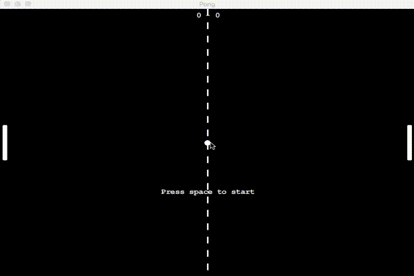
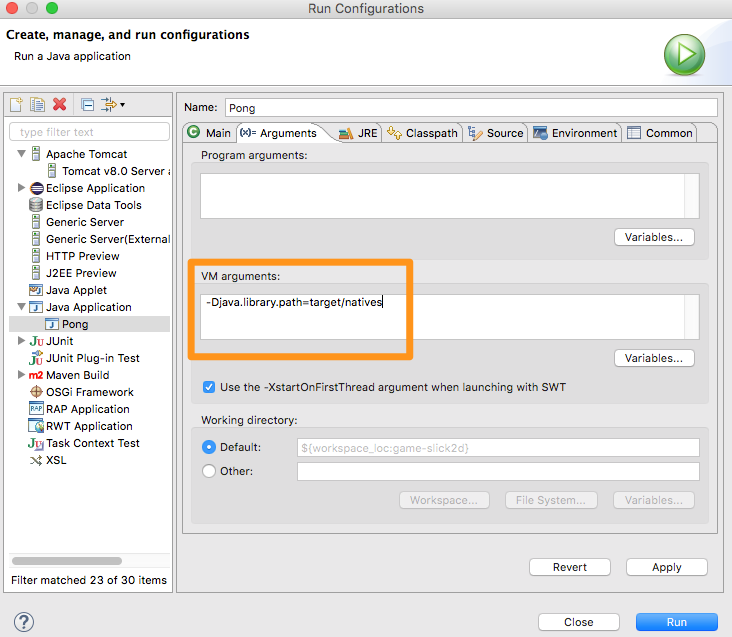

# Artificial Intelligence with Slick2d

Simple game using Slick2d Library


## Prerequires

1. Git 2.6+
2. Maven 3+
3. Java 8+


## How to Play

Clone

```
git clone https://github.com/humbertodias/artificial-intelligence-slick2d.git
```

Inside the folder

```
cd artificial-intelligence-slick2d
```

Export

**Windows**

```
set MAVEN_OPTS=-Djava.library.path=target/natives
```

**Linux | Mac**

```
export MAVEN_OPTS=-Djava.library.path=target/natives
```

Run

```
mvn package exec:java -Dexec.mainClass="com.me.game.Pong"
```

### Output



## Manual steps

* You must have the Maven **Eclipse** integration plugin installed (m2e)
* Import the Maven project
* Right-click on `Game`, Debug as, Java application
* This will fail with `java.lang.UnsatifsiedLinkError`
* Run `mvn package` once, the native libraries will get copied in `target/natives`
* Edit your debug configuration (menu Run, Debug configurations...), on the "Arguments" tab, "VM Arguments" field, enter `-Djava.library.path=target/natives`
* Click on "Debug" and you're all set !





## References

[http://slick.ninjacave.com](http://slick.ninjacave.com)

[http://wiki.lwjgl.org/index.php?title=Setting_Up_LWJGL_with_Maven](http://wiki.lwjgl.org/index.php?title=Setting_Up_LWJGL_with_Maven)

[Revista como programar: Pong com Slick2D](http://www.portugal-a-programar.pt/revista-programar/edicoes/download.php?e=25&t=site)
